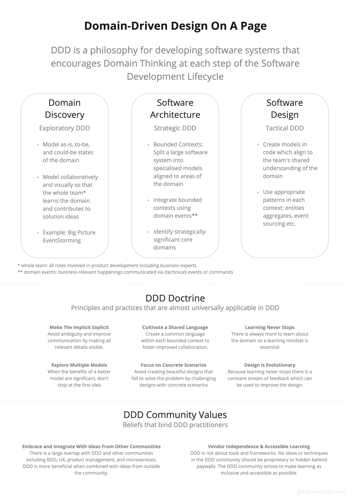

# Welcome to DDD

This project contains definitions of DDD and fundamental concepts to reduce the learning curve and confusion.

## Getting started with DDD

DDD is not an all-or-nothing deal. You can apply the ideas from DDD as much or as little as you feel is beneficial to the project you're working on.

For some projects you might just apply DDD to your discovery work, for other projects you might skip strategic DDD and just start by modelling in code with some lightweight visualization. Don't feel pressured into over-applying DDD.

Here are some of the ways in which you can get started with learning DDD or applying it immediately to your current project.

- Check out [The DDD Starter Modelling Process](https://github.com/ddd-crew/ddd-starter-modelling-process) if you want to see how DDD can be applied cohesively to different aspects of software development from discovery to strategic to tactical.

- Get started with hands-on techniques using [Visual Collaboration Tools](https://leanpub.com/visualcollaborationtools), a free ebook containing workshop recipes for a number of collaborative DDD techniques including EventStorming, Domain Storytelling, Domain Quiz, and Context Mapping.

- Read Eric Evans' [DDD Reference Guide](https://www.domainlanguage.com/wp-content/uploads/2016/05/DDD_Reference_2015-03.pdf) which provides definitions for the traditional DDD patterns.
